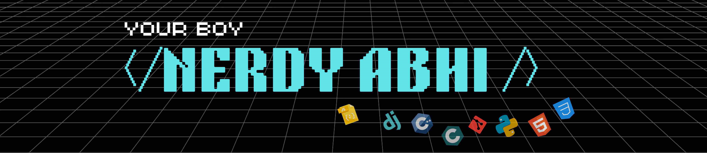

 

<h1 align="left">Hey 👋 I do cool stuffs here :) </h1>

###

<h4 align="left">💬 Ask me about <b>data structures , algorithms , NerdyStuffs </b>   📫 How to reach me <a href = "mailto: officeAbhiSharma@gmail.com" > OfficeAbhiSharma@gmail.com </a>  ⚡ My humour is bad  but my code is worse</h4>

###

  
  
  

   

###

 

<h3 align="left">Languages and Tools:</h3>

            

<h2 align = "left" >  Holopin :  </h2>

###

 

###

  

###

  

###
